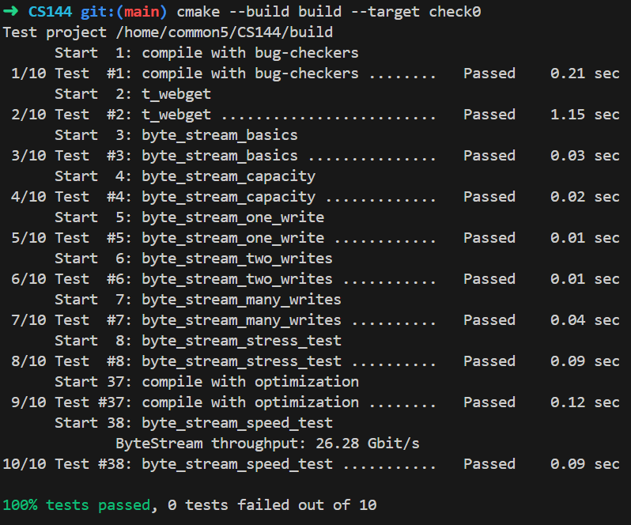

# LAB O. networking warmup

## 1.配置环境

最开始使用的是推荐的VirtualBox + 课程提供的镜像文件, 然而在测试ByteStream的时候出现了我难以理解并解决的Bug, CSDN上有个老哥跟我一样使用推荐环境, 然而都出现了类似的Bug, 以及我借了一份别人在docker中自己配置的环境中能完全通过的代码, 在我的环境中仍然有概率出现Bug, 个人猜测是该环境下对于资源的释放的处理不太一样. 考虑到后续的代码都建立在前面作业的基础上, 最开始就出问题太伤了, 于是我也整了个docker环境, 结果运行畅通无阻, 连着测几次都是没问题的, 干脆就放弃VirtualBox了, 这玩意也确实很笨重, 建议大家想做的话也用docker, 相比VirtualBox速度更快, 占的空间也更少, 如果会docker的话配起来不用半小时(大部分时间都花在等待上了)
放一份dockerfile在这里, 稍作修改就可以拿去自己用了
```dockerfile
FROM ubuntu:23.10

ARG USR=你的GitHub名
ARG EMAIL=你GitHub绑定的邮箱

ENV TZ=Asia/Shanghai \
    DEBIAN_FRONTEND=noninteractive

# 部署环境
RUN echo 'root:为 root 用户设置一个密码，不在这里设也可以，但记得进入系统后要设置' | chpasswd \
    && apt-get update -y \
    && apt-get install -y sudo vim wget git zsh \
    && apt-get clean -y \
    && userdel -rf ubuntu \
    && useradd -ms /bin/zsh ${USR} \
    && usermod -aG sudo root \
    && usermod -aG sudo ${USR} \
    && echo '你的 Git 用户名:你的用户在 Ubuntu 中的密码' | chpasswd

USER ${USR}

COPY --chown=${USR}:${USR} ./*.sh /home/${USR}/
RUN sh -c "$(wget -O- https://install.ohmyz.sh/)" \
    && git config --global user.name "${USR}" \
    && git config --global user.email "${EMAIL}" \
    && mkdir -p /home/${USR}/cs144

WORKDIR /home/${USR}/

```


## 2.使用telnet命令获取网页

跟着一步步做就好，唯一需要注意的点在于进入telnet命令窗口后需要快速地把后续步骤做完，不然会408 Request Timeout，困扰了我很久。。出现400多半是哪里输错了，尽量复制粘贴教程的命令

还有两个和sunetid有关，这玩意我没有，跳过。。

## 3.使用linux提供的stream socket编写网络程序

## 3.1.用git克隆远程仓库

具体没啥多说的，直接复制粘贴教程代码即可

如果想将代码上传到自己的私人仓库，可以查看教程https://stackoverflow.com/questions/10065526/github-how-to-make-a-fork-of-public-repository-private，大致包含了复制旧仓库，上传新仓库两步操作，教程详细，经测试可用

## 3.2.write webget

实现类似于2中使用telnet发送http get请求的程序，代码量10行左右, 但没有经验的话做起来还是很困惑的. 除去教程中要求查看的socket.hh和file_descriptor.hh，还建议查看address.hh的public方法，有关ip地址的问题可以在里面找到答案

我在测试过程遇到的问题，解决方式仅供参考：

- 使用`FileDescriptor::read(vector<string>&)`发现无法读到数据，vector的size一直是0，于是尝试使用另一个重载：`FileDescriptor::read(string&)`，发现string是可以正常读到数据的.
- 仅使用一次read无法通过测试。这个其实在hints中有提到，又看了一遍hints才看见。。必须循环调用read，直到eof停止
- 输出得到的信息的时候不要加endl或者‘\n'，只需要cout << 得到的信息即可

## 3.3.实现一个内存中可靠的ByteStream

本项内容主要实现一个在内存中可靠且读写相对高效的字节流

`ByteStream`基本功能的实现并不困难，基本框架已经给出，只需要简单的进行一些添加和修改就能完成最基本的`ByteStream`读写功能。

本实验的难点在于`ByteStream`读写性能上的优化。我最开始尝试性的使用string保存data，peek()函数中也直接将`string`转为`string_view`返回，这导致了我的读写性能相当差劲，测试速度仅有0.01Gbit/s，这个方法显然过于粗鲁和低效，并不能满足实验的要求。

我的优化思路：注意到peek函数的返回类型是`string_view`，这是一个轻量化的容器，它的内部仅保存了一个只读指针和指针指向的字符串的长度，这是本题一个很好的突破口。然而用string_view直接保存字符串肯定是不可行的，因为`string_view`是只读的，push功能必然要进行：(1).`string_view to string` (2).`string to longer string` (3)`longer string to string_view`，其中(1)和(2)都必然存在内存的复制，在字符串较长的时候，复制的开销很大，非常影响读写速度，因此我们在优化过程中需要尽可能避免内存的复制。那么优化的思路就很清晰了。

我的优化思路：既要尽可能的避免内存的复制，又需要存储多个字符串拼接成“流”，那么就使用`queue<string>`(`queue<string>`同理)存储字符串，借助`std::move`将data直接转为右值引用后直接移动到队列尾部，这样一来我们在push的过程中时间开销就变得非常小，达到了`O(1)`。接下来就是对string_view的合理运用：定义一个`string_view`类型的成员`preview`，让它在`ByteStream`进行读写操作时始终指向队列中的第一个`string`，在`peek`函数调用时可以直接返回`preview`。由于string_view有一个非常方便的方法`remove_prefix(len)`，它的功能与string::substr(len)功能类似，但是它不存在内存的复制，只移动了内部的指针。借助这个方法，在进行ByteStream的pop的过程中，如果需要pop的长度已经小于队列首元素的长度，我们可以直接调用`preview.remove_prexif(expected_popping_length)`，以此避免了获取首部字符串的子串再推回队列的繁琐且开销大的过程。

docker环境下吞吐速度快的吓人, 直接薄纱VirtualBox环境下的吞吐速度, 侧面说明VirtualBox笨重, 同样的代码VirtualBox甚至跑不到5Gbit/s(虽然也远超要求了, 奈何VirtualBox环境下老出AddressSanitizer:DEADLYSIGNAL, 之前查bug给我查的都快蚌埠住了, 差点弃坑)

