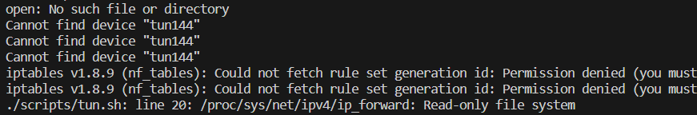
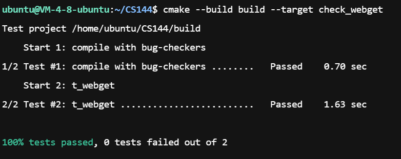

如果你使用的是微软商店提供的wsl, 而不是自己通过源码编译的wsl, 那么你在运行`tun.sh`脚本时应该可以见到类似如下错误

为了解决这个问题, 你可以:
- 自行下载源码并编译完整wsl2内核, 并用它替换你现有的微软提供的wsl
- 根据lab最开始的推荐方式, 使用virtualBox运行ubuntu23.10虚拟机

我在使用lab提供的虚拟机环境中测试checkpoint0时出了一堆我理解不了的问题 (偶尔在测试的时候会爆出一大坨`AddressSanitizer:DEADLYSIGNAL`, 1秒钟喷了十几万行出来, 离奇的是, 编译命令应该设置了AddressSanitizer错误出现一次时就应该停止测试了, 但我这个错误直到测试超时才会停止, 我不保证我的代码没问题, 但是我保持对lab提供的虚拟机的怀疑)

然而我也不想再去编一个wsl2内核, 所以我选择了一个折中的办法: 在我的服务器上跑代码
服务器的操作系统是ubuntu22.04, 但是运行没任何问题, 唯一的问题是ubuntu22.04的包管理器下载的cmake版本不满足lab需求的最低版本
所以需要下载cmake的源码自行编译, 可以在`https://cmake.org/files/`选择你喜欢的cmake版本下载, 只要不低于3.24.2即可

我的代码运行的很成功, 所以文档没有写debug, 如果需要debug, 请参考check4.pdf中有关debug的部分

收集数据的任务不想做了, 我是懒狗